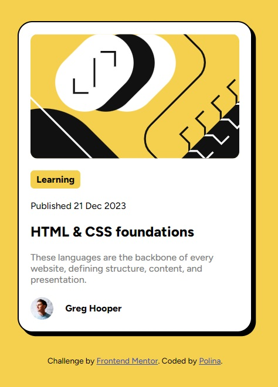

# Frontend Mentor - Blog preview card solution

This is a solution to the [Blog preview card challenge on Frontend Mentor](https://www.frontendmentor.io/challenges/blog-preview-card-ckPaj01IcS). Frontend Mentor challenges help you improve your coding skills by building realistic projects. 

## Table of contents

- [Overview](#overview)
  - [The challenge](#the-challenge)
  - [Screenshot](#screenshot)
  - [Links](#links)
- [My process](#my-process)
  - [Built with](#built-with)
  - [What I learned](#what-i-learned)
  - [Continued development](#continued-development)
  - [Useful resources](#useful-resources)
- [Author](#author)

## Overview

### The challenge

Users should be able to:

- See hover and focus states for all interactive elements on the page

### Screenshot

### Links

- Solution URL: [GitHub](https://github.com/polinagusakova/Blog-preview-card)
- Live Site URL: [GitHub pages](https://polinagusakova.github.io/Blog-preview-card/)

## My process

### Built with

- Semantic HTML5 markup
- CSS custom properties
- Flexbox
- Javascript

### What I learned

I learned how to work with HTML and CSS. Also how to center divs and how to use Flexbox layout. How to use :hover and :active state.
Including Javascript.

### Continued development

I want to continue practicing with responsible design and accessibility.

### Useful resources

- [MDN resources](https://developer.mozilla.org/en-US/) - This helped me for searching information and to found answers.
- [Stack Overflow](https://stackoverflow.co/) - This helped me for searching information from people, who already encoutered with same problem as me.

## Author

- Website - [Polina](https://github.com/polinagusakova)
